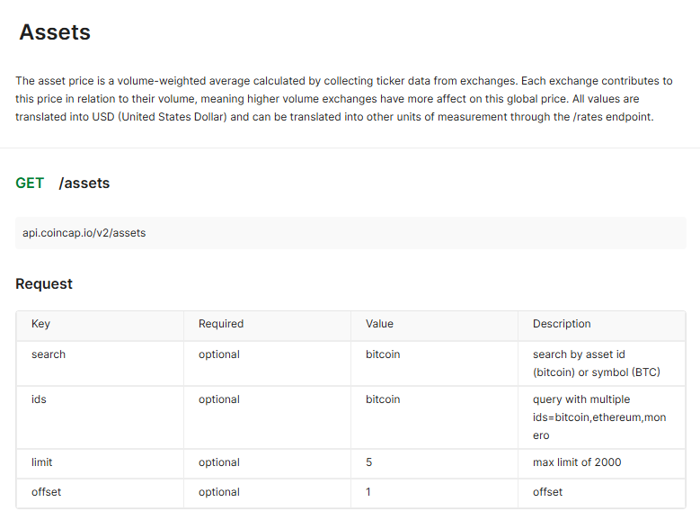
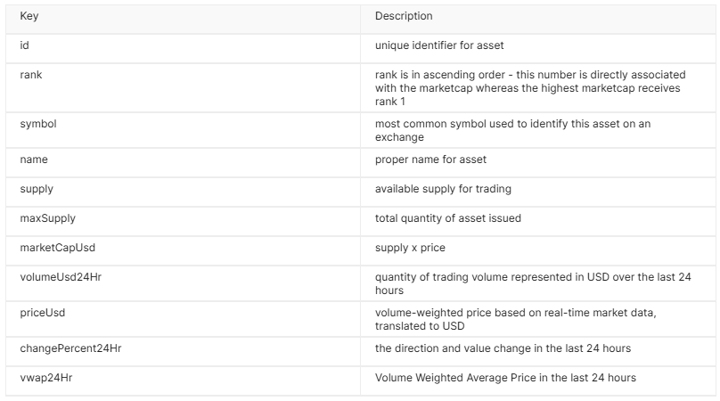

# RestAPI-testing

Testing RestAPI with pytest

## Target API

[CoinCap API](https://docs.coincap.io/#intro) Asset API

### Return Content

#### Crypto Information

## test cases

| Index | Test Case Name                       | Validation Type   | Purpose                                                                                                     |
| ----- | ------------------------------------ | ----------------- | ----------------------------------------------------------------------------------------------------------- |
| 1     | test_timestamp                       | positive function | Verifies that the API response contains a valid timestamp field.                                            |
| 2     | test_no_parameters                   | positive function | Verifies that all assets are returned when no query parameters are provided.                                |
| 3     | test_asset_field_type                | Positive function | Verifies assets fields is correct                                                                           |
| 4     | test_asset_fields                    | Positive function | Verifies that assets contain essential fields such as 'id', 'name', 'symbol', etc.                          |
| 5     | test_ids_parameter_bitcoin           | Positive function | Verifies the response when using an known Bitcoin ids which will only return Bitcoin information.           |
| 6     | test_invalid_search_parameter        | Positive function | Verifies the response when using an invalid search parameter.                                               |
| 7     | test_limit_parameter                 | Positive function | Verifies the API correctly applies the 'limit' parameter to return the correct number of assets.            |
| 8     | test_limit_parameter_bound           | Positive boundary | Verifies the API 'limit' parameter can return the correct upper bound.                                      |
| 9     | test_invalid_limit_negative          | Negative smoke    | Verifies that the API returns a 400 error with the correct message when the 'limit' parameter is -1.        |
| 10    | test_invalid_limit_exceed_upperbound | Negative smoke    | Verifies that the API returns a 400 error with the correct message when the 'limit' parameter exceeds 2000. |

## Requirements

* Select any of the API mentioned in [public-apis](https://github.com/public-apis/public-apis)
* Write 2 (or more) test cases for any of the above API options
* implement an automation test for each test case using Python
* For each test case:
  * Clear steps for the test
  * Expected result
  * How the expected result will be validated (make sure the answer is what we expected)
  * Implementation in Python.
  * (recommendation) Use Pytest parametrize to reduce code but maintain high coverage.
  * A mixture of positive and negative scenarios
* Think in framework design and modularity
* README should include the test case written for the test in a table form
* Description of what validation is been used and why the candidate used this type of validation
